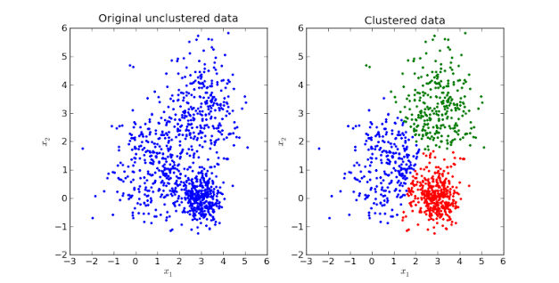

---

title: Introduction to AI Olympiad
difficulty: 1
-------------

# Introduction to AI Olympiad

AI Olympiad problems are different from traditional programming contest problems. Instead of designing an exact algorithm that always produces the correct answer, you are often given **data** and asked to build a model that makes the best possible predictions.

This chapter briefly introduces some of the most common problem types you may encounter in an AI competition.

---

## 1. Tabular Classification

In a classification problem, the goal is to predict a **category or class** from structured data.

Example dataset:

| Age | Income | Study Hours | Passed |
| --: | -----: | ----------: | ------ |
|  18 |   1200 |           5 | Yes    |
|  20 |   1500 |           2 | No     |
|  19 |   1300 |           7 | Yes    |

Here, the target is `Passed`.

### Binary Classification

Binary classification has exactly **two possible classes**.

```text
0 = No disease
1 = Disease
```

Other examples include:

```text
Spam / Not Spam
Fraud / Not Fraud
Pass / Fail
```

### Multiclass Classification

Multiclass classification has **more than two possible classes**.

```text
0 = Cat
1 = Dog
2 = Bird
3 = Fish
```

---

## 2. Tabular Regression

Regression problems predict a **numerical value** rather than a category.

Example:

| Area | Bedrooms | Age | House Price |
| ---: | -------: | --: | ----------: |
|   80 |        2 |  10 |      250000 |
|  120 |        3 |   5 |      410000 |
|   60 |        1 |  20 |      180000 |

Here, the target is `House Price`. Other regression tasks may involve predicting:

```text
Temperature
Salary
Energy consumption
Travel time
```

---

## 3. Image Classification

In image classification, the input is an **image** and the model predicts which class the image belongs to.

Example:

```text
image_001.jpg → Cat
image_002.jpg → Dog
image_003.jpg → Bird
```

The model usually predicts one class for the entire image.

---

## 4. Object Detection

Object detection identifies both:

```text
What objects are present?
Where are they located?
```

For example, an image may contain:

```text
Person        → bounding box
Car           → bounding box
Traffic light → bounding box
```

A bounding box is commonly represented using coordinates such as:

```text
class, x_min, y_min, x_max, y_max
```

Unlike image classification, object detection can identify **multiple objects in the same image**.

---

## 5. Image Segmentation

Image segmentation goes one step further than object detection. Instead of drawing a box around an object, the model predicts a class for individual **pixels**. For example, the model may label pixels as:

```text
Road
Car
Person
Building
Background
```

This allows the model to determine the exact shape and area occupied by each object or region.

---

## 6. Text Classification

Text classification predicts a **category from text**. For example:

```text
"I love this product." → Positive
```

or:

```text
"Congratulations! You won $1,000,000!" → Spam
```

Common text classification tasks include:

```text
Sentiment analysis
Spam detection
Topic classification
Intent detection
```

---

## 7. Text Generation

Some problems require the model to **generate new text** rather than select a predefined class. For example:

```text
Input:
Translate "Good morning" into French.

Output:
Bonjour.
```

Other examples include:

```text
Question answering
Text summarization
Translation
Dialogue generation
```

These tasks are often solved using language models.

---

## 8. Time-Series Forecasting

Time-series problems involve data collected **over time**.

Example:

| Day       | Electricity Demand |
| --------- | -----------------: |
| Monday    |                120 |
| Tuesday   |                135 |
| Wednesday |                128 |
| Thursday  |                  ? |

The goal is to use previous observations to predict future values. Common examples include forecasting:

```text
Weather
Electricity demand
Traffic
Sales
Stock prices
```

Because the order of observations matters, time-series data must be handled differently from ordinary tabular data.

---

## 9. Clustering

Clustering is an **unsupervised learning** problem. Unlike classification, there may be no target column. The goal is to automatically group similar examples together.

For example, a clustering algorithm might discover groups of customers with similar behavior:

```text
Group 1 → Frequent customers
Group 2 → Occasional customers
Group 3 → New customers
```



The model is not told what the groups should be. It discovers patterns from the data itself.

---

## 10. Supervised vs Unsupervised Learning

**Supervised learning** uses labeled data. Each training example contains both input features and a known target, allowing the model to learn how inputs relate to outputs. Classification and regression are the most common supervised learning problems.

**Unsupervised learning** uses data without known targets. Instead of predicting a predefined answer, the model tries to discover patterns or structure in the data. Common examples include clustering and dimensionality reduction.

A useful rule of thumb is:

```text
Target to predict → Supervised Learning
No target → Unsupervised Learning
```

Examples:

**Supervised Learning**

```text
Classification
Regression
Image classification
Object detection
Text classification
Time-series forecasting
```

**Unsupervised Learning**

```text
Clustering
Dimensionality reduction
Anomaly discovery
```

---

## Summary

When you encounter a new AI Olympiad problem, first identify the **input data** and the **expected output**. Correctly identifying the problem type is the first step toward choosing an appropriate model, evaluation metric, and solution strategy.
